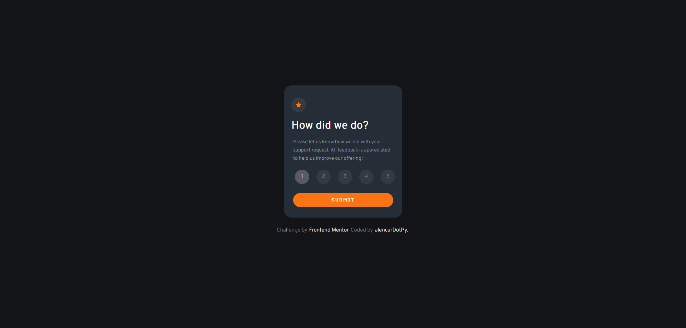
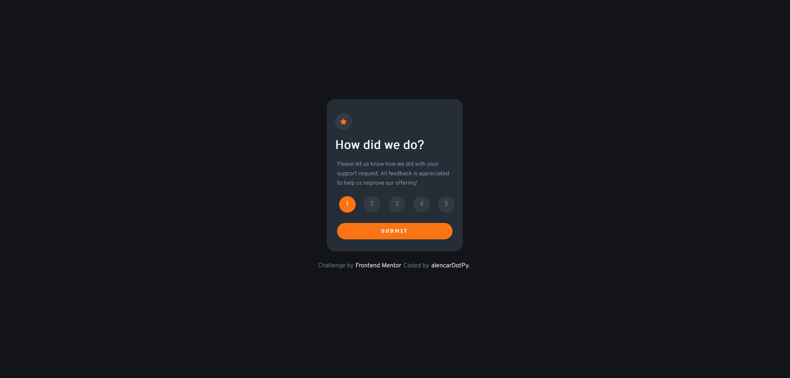

# Frontend Mentor - Interactive rating component solution

This is a solution to the [Interactive rating component challenge on Frontend Mentor](https://www.frontendmentor.io/challenges/interactive-rating-component-koxpeBUmI). Frontend Mentor challenges help you improve your coding skills by building realistic projects.

## Table of contents

- [Overview](#overview)
  - [The challenge](#the-challenge)
  - [Screenshot](#screenshot)
  - [Links](#links)
- [My process](#my-process)
  - [Built with](#built-with)
  - [What I learned](#what-i-learned)
- [Author](#author)

## Overview

### The challenge

Users should be able to:

- View the optimal layout for the app depending on their device's screen size
- See hover states for all interactive elements on the page
- Select and submit a number rating
- See the "Thank you" card state after submitting a rating

### Screenshot

##### Desktop View






##### Mobile View


### Links

- Solution URL: [Repo in github.](https://github.com/alencardotpy/interactive-rating-component)
- Live Site URL: [live](https://interactive-rating-component-rose.vercel.app/)

## My process

### Built with

- Semantic HTML5 markup
- CSS custom properties
- Flexbox
- Mobile-first workflow
- [React](https://reactjs.org/) - JS library
- [BEM](http://getbem.com/introduction/) - methodology

### What I learned

I started using BEM in my project and let me tell you that it has blow my mind while composing the style, y'all should try it if you haven't yet!

Some exemple from [GetBEM](http://getbem.com/introduction/), see below:

#### HTML

```html
<button class="button">
 Normal button
</button>
<button class="button button--state-success">
 Success button
</button>
<button class="button button--state-danger">
 Danger button
</button>
```

#### CSS

```css
.button {
 display: inline-block;
 border-radius: 3px;
 padding: 7px 12px;
 border: 1px solid #D5D5D5;
 background-image: linear-gradient(#EEE, #DDD);
 font: 700 13px/18px Helvetica, arial;
}
.button--state-success {
 color: #FFF;
 background: #569E3D linear-gradient(#79D858, #569E3D) repeat-x;
 border-color: #4A993E;
}
.button--state-danger {
 color: #900;
}
```

## Author

- Github - [< alencarDotPy />](https://github.com/alencardotpy)
- Frontend Mentor - [@alencardotpy](https://www.frontendmentor.io/profile/alencardotpy)
- Twitter - [@alencardotpy](https://www.twitter.com/yourusername)
